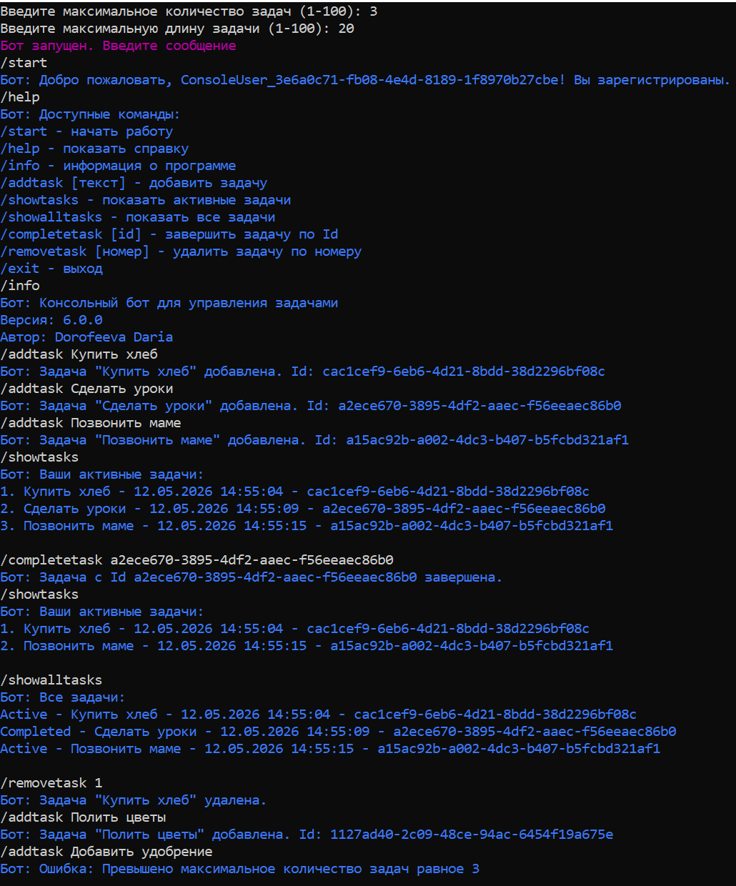

# 🤖 Консольный бот: Интерфейсы и архитектура

## 📋 Описание проекта
Консольный бот с управлением задачами, построенный на интерфейсах и сервис-ориентированной архитектуре.  
Разработано в рамках домашнего задания №5: имитация Telegram Bot API через библиотеку `Otus.ToDoList.ConsoleBot`.

## 🆕 Ключевые изменения (ДЗ №5)
- Подключена библиотека `Otus.ToDoList.ConsoleBot`
- Создан класс `UpdateHandler`, реализующий `IUpdateHandler`
- Добавлены интерфейсы `IUserService` и `IToDoService`
- Логика команд перенесена в `UpdateHandler`
- Сервисы не зависят от вывода (консоль/Telegram)
- Команды `/addtask` и `/removetask` принимают аргументы
- Добавлены `/completetask` и `/showalltasks`
- Свои исключения вынесены в отдельную папку

## 🎮 Доступные команды
| Команда | Описание |
|---------|----------|
| `/start` | Начать работу (авторегистрация) |
| `/help` | Показать справку |
| `/info` | Информация о программе |
| `/addtask [текст]` | Добавить задачу |
| `/showtasks` | Показать активные задачи |
| `/showalltasks` | Показать все задачи |
| `/completetask [id]` | Завершить задачу по Id |
| `/removetask [номер]` | Удалить задачу по номеру |
| `/exit` | Выход |

## 📸 Демонстрация работы

## ✅ Критерии выполнения
- Подключена библиотека `Otus.ToDoList.ConsoleBot`
- Класс `UpdateHandler` реализует `IUpdateHandler`
- `ToDoUser` с `TelegramUserId`
- `IUserService` и `UserService`
- `IToDoService` и `ToDoService` (лимиты, длина, дубликаты)
- Команды с аргументами (`/addtask`, `/removetask`, `/completetask`)
- `/showalltasks` со статусом Active/Completed
- Упрощённый catch в HandleUpdateAsync

## 👤 Автор
Дорофеева Дарья
Дата: 30.04.2026

## 📄 Лицензия
MIT License